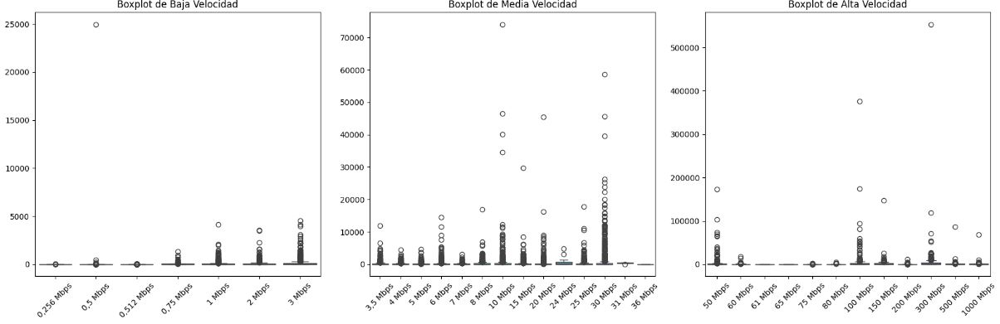

# Proyecto de Análisis de Accesos a Internet y Ingresos

## Introducción
Este proyecto tiene como objetivo analizar los accesos a internet y los ingresos trimestrales en diferentes provincias de Argentina. Utilizamos KPIs para medir y monitorear el rendimiento en estas áreas.

## Estructura del Repositorio
El repositorio contiene los siguientes archivos y carpetas:

- **data/**: Carpeta que contiene los datasets utilizados para el análisis.
- **dashboards/**: Carpeta que contiene los dashboards generados.
- **Analisis Descriptivo/**: Carpeta que contiene los scripts utilizados para el análisis descriptivo (EDA).
- **imagenes/**: Carpeta que contiene imágenes de las gráficas del EDA.

## Análisis Exploratorio de Datos (EDA)

### 1. Exploración Inicial de los Datos
Se revisaron las primeras filas de cada DataFrame para entender la estructura de los datos y se verificaron los valores faltantes en los datasets. Por ejemplo, la columna `Acc_vel_loc_sinrangos` presentaba un total de 351,902 valores faltantes. Los valores nulos se reemplazaron por el número 0 debido a que son columnas con datos numéricos.

### 2. Limpieza de Datos
Se eliminaron los duplicados de las pestañas `Acc_vel_loc_sinrangos`, `Accesos_tecnologia_localidad`, `Totales Accesos Por Tecnología`, y `Accesos Por Tecnología`. También se pasó las columnas numéricas decimales a datos enteros.

### 3. Análisis de Tecnologías de Conexión
Se exploraron los accesos a internet por localidad y tipo de tecnología (ADSL, fibra óptica, etc.) y su distribución a nivel provincial y local. Este análisis permitió determinar qué tecnologías son predominantes y en qué regiones.

### 4. Identificación de Outliers
Se identificaron y visualizaron outliers en los DataFrames seleccionados utilizando diagramas de caja (boxplots) para las variables cuantitativas. Las gráficas mostraron que:

- **Fibra Óptica** es una tecnología predominante en ciertas localidades, con varios outliers que indican áreas con accesos significativamente altos.
- **ADSL y Cablemodem** muestran una mayor variabilidad en el número de accesos, sugiriendo una distribución más dispersa entre localidades.

### 5. Análisis de Penetración de Internet
Se analizó la penetración de internet en hogares utilizando la pestaña `Penetración-hogares`. Se identificó que:

- La provincia con la mayor penetración de internet en hogares es **Capital Federal**, con 124.06 accesos por cada 100 hogares.
- La provincia con la menor penetración de internet en hogares es **San Luis**, con 9.35 accesos por cada 100 hogares.

### 6. Evaluación de la Calidad de Conexión y Velocidades
Se exploró la tecnología de conexión más prevalente en cada provincia y se visualizaron los accesos por tipo de tecnología. También se analizaron la calidad de la conexión a internet y la velocidad media descargada en diferentes provincias.

### 7. Análisis de Ingresos por Servicios de Internet
Se evaluaron los ingresos generados por los servicios de internet para obtener una visión clara de la rentabilidad del servicio en diferentes regiones. Esto permitió identificar áreas con mayor potencial de crecimiento económico.

### 8. Identificación de Oportunidades de Expansión
Se combinaron datos para identificar áreas donde se pueden implementar mejoras en la infraestructura tecnológica, enfocándose en regiones con baja velocidad de conexión o alta demanda de servicios para optimizar la calidad del servicio.

## Conclusión
El análisis realizado proporciona una base sólida para la toma de decisiones estratégicas en la expansión y mejora de los servicios de internet en Argentina, identificando tanto áreas con alto potencial de crecimiento como regiones que requieren mejoras en infraestructura.

---

_El análisis completo, incluyendo los scripts de EDA y las visualizaciones generadas, se encuentra disponible en este repositorio._
